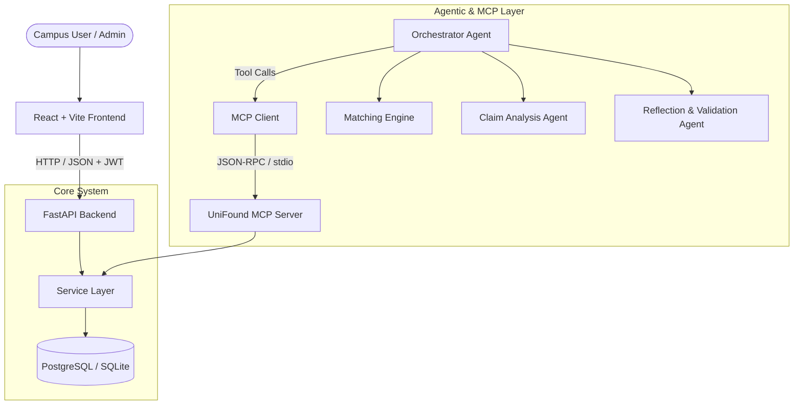
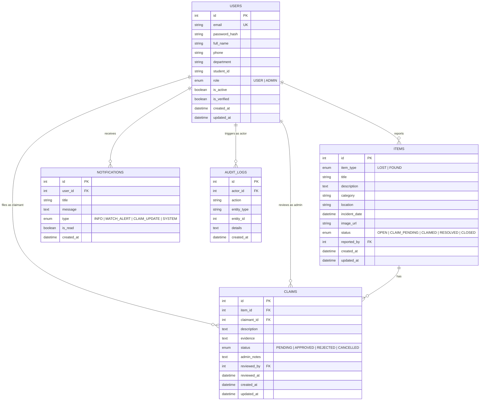

# UniFound System Architecture

## Overview

UniFound is architected as a modular, decoupled full-stack platform consisting of five main subsystems:

1. **Frontend Web Client (React + TypeScript + Vite)**
   - High-polish responsive user interface.
   - Client-side routing with JWT-backed authenticated route guards.
   - Dedicated views for Students, Faculty, and Campus Administrators.

2. **Backend REST API (FastAPI + SQLAlchemy + Pydantic)**
   - RESTful endpoints covering Auth, Items, Claims, Verification, and System Metrics.
   - Clean Service Layer architecture isolating business logic from database operations.
   - Role-Based Access Control (USER vs ADMIN).

3. **Database Layer (SQLAlchemy 2.0 ORM + Alembic Migrations + PostgreSQL/SQLite)**
   - Relational data model managing Users, Items, Claims, Notifications, and Audit Logs.
   - Alembic versioned migrations with automatic schema synchronization.

4. **Model Context Protocol (MCP) Server & Client**
   - Implements standardized MCP protocol tools (`search_items`, `find_matches`, `get_claim`, `get_statistics`, etc.).
   - Mediates access between AI agents and the UniFound service layer. AI agents never touch the database directly.

5. **Agentic AI Subsystem**
   - Multi-agent orchestration:
     - **Orchestrator Agent**: ReAct loop, tool selection, multi-step execution.
     - **Matching Agent**: Multi-factor matching engine with explainable confidence scoring.
     - **Claim Analysis Agent**: Automated evidence consistency evaluation.
     - **Reflection/Validation Agent**: Safety and correctness validator.



---

## Production Database Schema (Phase 2)



---

## ItemStatus Lifecycle State Machine

```
     [ Report Filed ]
            │
            ▼
        ┌───────┐
        │  OPEN │ ◄──────────────────────────┐
        └───┬───┘                            │
            │ (Claim Filed)                  │ (All Claims
            ▼                                │  Rejected / Cancelled)
     ┌──────────────┐                        │
     │ CLAIM_PENDING├────────────────────────┘
     └──────┬───────┘
            │ (Admin Approves Claim)
            ▼
        ┌─────────┐
        │ CLAIMED │
        └────┬────┘
             │ (Handover Confirmed by Owner)
             ▼
        ┌──────────┐
        │ RESOLVED │
        └────┬─────┘
             │ (Archived / Closed)
             ▼
        ┌────────┐
        │ CLOSED │
        └────────┘
```

### Allowed Status Transitions

| Current Status | Allowed Target Statuses | Trigger Event |
|----------------|--------------------------|---------------|
| `OPEN` | `CLAIM_PENDING`, `CLOSED` | Claim submitted by user, or reporter cancels report |
| `CLAIM_PENDING` | `OPEN`, `CLAIMED`, `CLOSED` | Rejection of pending claims, admin approval, or cancellation |
| `CLAIMED` | `RESOLVED`, `CLOSED` | Item physically returned to confirmed owner |
| `RESOLVED` | `CLOSED` | Case archived by administrator |
| `CLOSED` | *(Terminal)* | Archived or cancelled |

---

## Integrity Constraints & Business Rules

1. **One Active Claim Per User + Item**:
   - Enforced by composite partial unique index:
     `uq_active_claim_per_user_item` on `(item_id, claimant_id)` where `status = 'PENDING'`.
   - Validated at the service layer in `ClaimService.create()`.
2. **User Soft-Delete & Preservation of History**:
   - Users are never hard-deleted in production flows; instead `user.is_active = False` is set via `UserService.deactivate()`.
   - Preserves complete integrity of historical reports, claims, reviewer records, and audit logs.
3. **Public Registration Security**:
   - Public registration endpoints (`/api/v1/auth/register`) strictly instantiate `UserRole.USER`. Admin accounts cannot be created by external web clients.
   - Initial administrative access is provisioned securely via `ADMIN_INITIAL_EMAIL` and `ADMIN_INITIAL_PASSWORD` environment variables without static production defaults.
